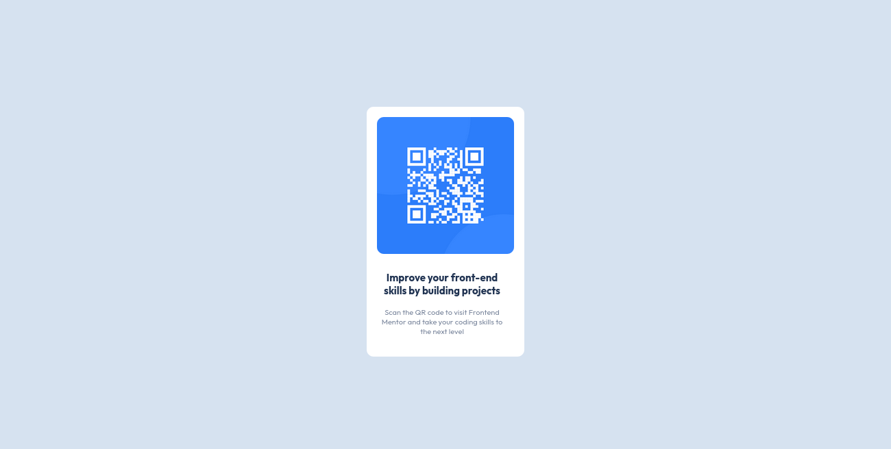

### Screenshot

### Links 

- Github pages 

## My process

### Built with

- Semantic HTML5 markup
- BEM methodology
- CSS custom properties

### What I learned

In this challenge I put into practice my css skills related to BEM methodology and the box model, making use of the respective properties of each element. This helped me to reinforce the theory of block/inline elements.

### Continued development

It's necessary to keep on writing modular classes with BEM methodology and learning about the normal flow of elements.

## Author

- Frontend Mentor - [@hastrolger](https://www.frontendmentor.io/profile/hastrolger)